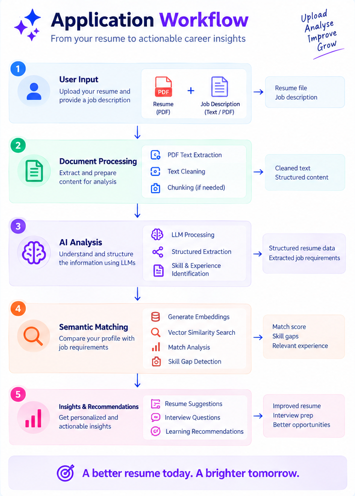
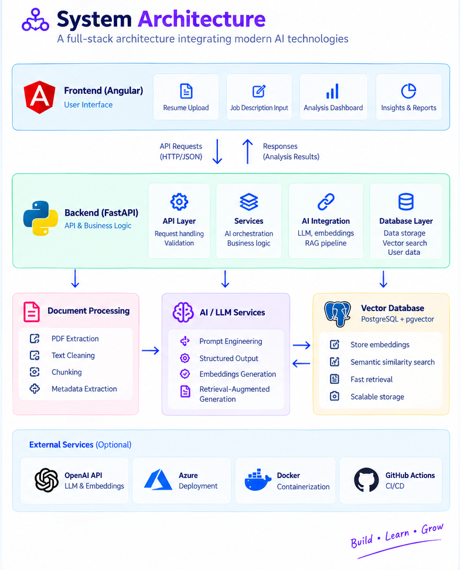

# 🤖 AI Resume Intelligence

<p align="center">
  <b>Transform Your Resume. Understand Your Gaps. Unlock Better Opportunities.</b>
</p>

<p align="center">
  An AI-powered resume intelligence platform that analyzes resumes, understands job requirements, identifies skill gaps, and provides personalized insights using Large Language Models and semantic search.
</p>

---

## 📌 Project Overview

**AI Resume Intelligence** is a full-stack AI application designed to help job seekers understand how well their resume aligns with a target job role.

The platform goes beyond traditional keyword-based resume checkers by combining **Large Language Models (LLMs), structured information extraction, embeddings, vector search, and Retrieval-Augmented Generation (RAG)** to understand the context of a candidate's experience and compare it with job requirements.

The application analyzes a candidate's resume and a target job description to provide meaningful insights such as:

* Resume and job alignment
* Relevant skills and experience
* Missing or weak skills
* Resume improvement suggestions
* Role-specific interview questions
* Personalized career insights

### 🎯 Purpose

The primary goal of this project is to explore how modern AI techniques can be integrated into a real-world full-stack application to make resume analysis more **context-aware, explainable, and useful**.

Instead of simply asking:

> "Does this resume contain the required keywords?"

the system aims to answer:

> "How well does this candidate's actual experience align with the requirements of this role, and what can they improve?"

---

# ✨ Key Features

### 📄 Resume Analysis

Upload a resume and use AI to extract structured information including:

* Professional experience
* Technical skills
* Projects
* Education
* Certifications
* Achievements

### 💼 Job Description Analysis

Analyze a target job description to identify:

* Required skills
* Preferred skills
* Technologies
* Experience requirements
* Responsibilities
* Domain-specific requirements

### 🔍 Semantic Resume Matching

Use embeddings and vector similarity to compare resume content with job requirements beyond simple keyword matching.

### 🧩 Skill Gap Analysis

Identify skills and areas that may require improvement for a particular role.

### 📊 Resume Insights

Generate personalized insights about the candidate's alignment with the target role.

### ✍️ Resume Improvement Suggestions

Use AI to identify areas where resume content can be improved for clarity, relevance, and impact.

### 🎤 Interview Question Generation

Generate technical, project-based, and behavioral questions based on the candidate's profile and target role.

---

# 🛠️ Technology Stack

## Frontend

* **Angular**
* **TypeScript**
* **HTML5 / CSS3**
* **Tailwind CSS**
* **RxJS**

Used for building the interactive resume upload, analysis dashboard, insights, and user interface.

## Backend

* **Python**
* **FastAPI**
* **Pydantic**
* **Uvicorn**

FastAPI acts as the API and orchestration layer connecting the frontend, document processing pipeline, database, and AI services.

## AI / Machine Learning

* **Large Language Models**
* **OpenAI API**
* **Prompt Engineering**
* **Structured Outputs**
* **Embeddings**
* **Semantic Search**
* **Retrieval-Augmented Generation (RAG)**

The AI layer is responsible for extracting structured information, understanding job requirements, performing semantic comparisons, and generating insights.

## Database

* **PostgreSQL**
* **pgvector**

PostgreSQL stores application data while `pgvector` enables vector storage and semantic similarity search.

## Document Processing

* PDF text extraction
* Text preprocessing
* Document chunking
* Structured information extraction

## DevOps

* **Docker**
* **Docker Compose**
* **GitHub Actions**
* **Azure**

---

# 🔄 Application Workflow

The overall workflow follows:

<p align="center">
  
</p>


---

# 🧠 How It Works

### 1. Resume & Job Description Input

The user provides:

```text
Resume.pdf
     +
Job Description
```

The application accepts the resume as a document and the job description as text or a document.

### 2. Document Processing

The backend extracts text from the uploaded documents and prepares it for AI processing.

```text
PDF
 ↓
Text Extraction
 ↓
Cleaning
 ↓
Chunking
```

### 3. AI-Powered Information Extraction

The processed content is sent to the LLM to identify meaningful information.

```text
Resume
 ↓
LLM
 ↓
Structured Resume Data
```

For example:

```json
{
  "skills": [
    "Java",
    "Spring Boot",
    "Angular",
    "PostgreSQL"
  ],
  "experience": [],
  "projects": []
}
```

### 4. Embedding & Semantic Search

Resume and job-description content can be converted into embeddings.

```text
Resume Content
      ↓
  Embeddings
      ↓
Vector Database
      ↑
  Embeddings
      ↑
Job Description
```

This allows the system to identify conceptually related experience even when the exact wording differs.

### 5. Matching & Analysis

The system compares the candidate's experience with the requirements of the target role.

```text
Resume
   +
Job Description
   ↓
Semantic Analysis
   ↓
Relevant Experience
   ↓
Skill Gaps
   ↓
Personalized Insights
```

### 6. AI-Generated Recommendations

The final analysis can include:

* Relevant strengths
* Skill gaps
* Resume improvement suggestions
* Areas requiring stronger evidence
* Interview preparation questions

---

# 🏗️ Architecture

<p align="center">
  
</p>

---

# 🚀 Future Enhancements

* Multiple job comparison
* Resume version management
* Job application tracking
* Personalized learning recommendations
* AI-generated cover letters
* Interview preparation dashboard
* User authentication and profiles
* Resume improvement history
* Azure deployment
* AI evaluation and observability
* Multi-language resume analysis

---

# 🎓 Learning Focus

This project explores the practical application of:

**LLMs → Structured Outputs → Embeddings → Vector Databases → Semantic Search → RAG → AI-powered Full-Stack Applications**

The objective is not only to build an AI application, but to understand how modern AI components can be designed and integrated into a production-oriented software system.

---

## 👩‍💻 Author

**Ann Mol**

Full Stack Developer | AI Enthusiast

Interested in building scalable software applications at the intersection of **Full-Stack Engineering and Artificial Intelligence**.

---

<p align="center">
  <b>Build • Learn • Experiment • Grow 🚀</b>
</p>
